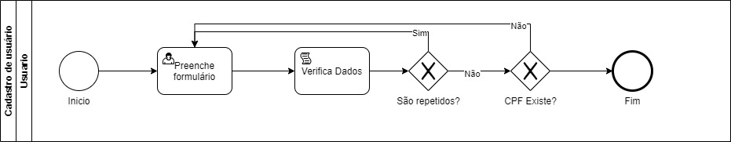
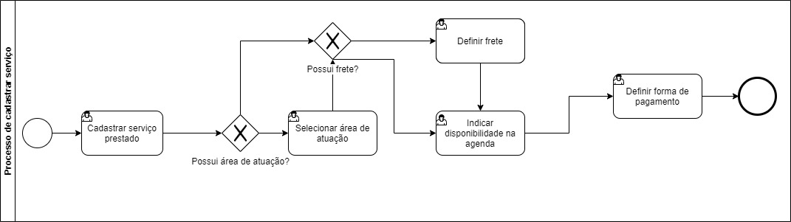
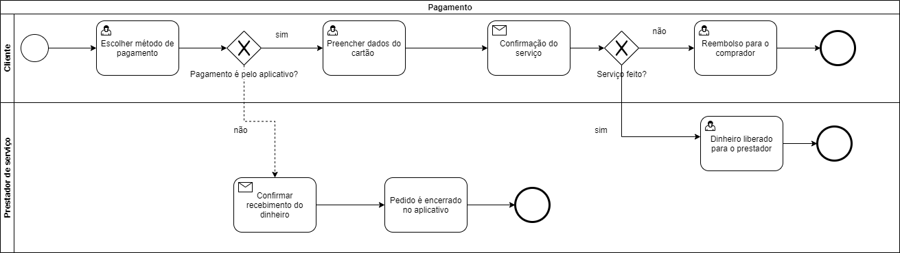
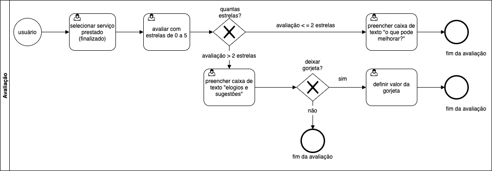

# Seek N' Hire

**Andre Cota Guimarães, 1202002@sga.pucminas.br**

**Anna Laura Reis Dornelas, annalaura.rdg@gmail.com**

**Frederico Martins Rodrigues, fredmrodrigues@outlook.com**

**Renan Cleyson Fagundes Pereira, rcfpereira@sga.pucminas.br**

**Vinicius Levi Viana de Oliveira, vinicius.levi@sga.pucminas.br**

---

_Curso de Engenharia de Software, Unidade Praça da Liberdade_

_Instituto de Informática e Ciências Exatas – Pontifícia Universidade Católica de Minas Gerais (PUC MINAS), Belo Horizonte – MG – Brasil_

---

_**Resumo**. Escrever aqui o resumo. O resumo deve contextualizar rapidamente o trabalho, descrever seu objetivo e, ao final,
mostrar algum resultado relevante do trabalho (até 10 linhas)._

---

## 1. Introdução

    1.1 Contextualização

A prestação de serviços de maneira autônoma aumentou com o passar dos anos. De acordo com o IBGE, em 2019, mais de 24 milhões de pessoas trabalhavam por conta propria, o que possibilitou uma redução na taxa de desemprego do país.

Considerando a pandemia da COVID-19, pode-se dizer que a taxa de trabalhadores autônomos tende a aumentar, assim como tende a aumentar o uso do meio digital, no qual pode ser utilizado como um novo meio para conectar o prestador ao empregador.

Assim, a necessidade de integrar o meio digital com a prestação de serviços se torna cada vez mais necessaria para se atingir um cenário melhor.

    1.2 Problema

Com a tendência da taxa de desemprego do país aumentar, a informalidade tende a ser a saída para várias pessoas. Dessa forma, redes sociais estão se tornando cada vez mais comuns para a divulgação de prestações de serviços, mas essas plataformas são limitadas por conta da função do aplicativo nunca ser a prestação de serviço.

Nesse sentido, as pessoas apresentam mais dificuldade em começar a prestar algum serviço, assim como pessoas a procura desses serviços apresentam dificuldade em encontra-los. Além disso, é necessario confiança entre contratante e prestador para o pagamento do serviço, o que pode dificultar ainda mais que ocorra a prestação.

Outro problema enfrentado por prestadores é a necessidade de organizar a sua agenda de serviços, o que pode lhe tomar tempo e, em caso de engano, o cliente e prestador sairiam penalizados.

Portanto, o prestador apresenta diversos problemas relacionado ao processo de atendimento, divulgação e pagamento de serviços, assim como clientes apresentam problemas em encontrar prestadores. Assim, os meios utilizados atualmente se mostram obsoletos para solucionar os problemas que prestadores de serviço e seus clientes podem ter.

    1.3 Objetivo geral

O objetivo com nosso trabalho é facilitar a busca por serviços no geral, tanto para os que procuram fornecer quanto aos que necessitam do serviço.

        1.3.1 Objetivos específicos

Oferecer um sistema que gerencie conexões entre pessoas prestadores ou que desejam contratar serviços, baseando-se na região em que elas se encontram. 
A aplicação fornecerá tambem um ranqueamento que informará ao usuário se a pessoa em contato presta um bom serviço ou se é um bom contratante.
Terá um calendário com as possibilidades de agendamento pelo próprio sistema.   

    1.4 Justificativas

Estamos com o intúito de desenvolver o projeto, pois apartir de perguntas levantadas em nosso questionário, boa parte das pessoas que precisam contratar algum
serviço específico tem somente como principais fontes: redes sociais, buscadores(como Goole, Bing etc) e indicações de conhecidos.
Ao desenvolver o projeto facilitaremos que as pessoas achem quem está a procura, possibilitando até mesmo achar serviços com uma maior qualidade e menor preço.

## 2. Participantes do processo

Foi feita uma análise através de um questionário virtual (disponível no link https://pt.surveymonkey.com/r/TI-Seekn-Hire) que definiu os seguintes perfis de usuário:
•    Pessoas interessadas em contratar um serviço informal de maneira objetiva, tendo como prioridade a segurança, agilidade e qualidade do serviço;
•    Pessoas interessadas em oferecer um ou mais serviços informais com o intuito de atingir uma quantidade abrangente de potenciais clientes.

Os perfis foram traçados em diferentes faixas etárias, ambos os sexos (masculino e feminino) e com objetivos específicos, filtrados e analisados pelo questionário.

Para respondentes que utilizaram o questionário se baseando em usuários que necessitam contratar algum serviço, destacam-se as respostas pela forma mais usual de busca por serviços, relatividade das avaliações pela qualidade de prestação dos serviços e a segurança para se efetuar o pagamento pelos serviços prestados.
A busca por serviços é geralmente realizada através de indicações de familiares e amigos. A busca no Google foi a modalidade que ocupou o segundo lugar no ranking, seguida por busca em empresas especializadas e grupos de redes sociais, respectivamente.
De forma unânime, os respondentes consideram que um profissional bem-avalidado/indicado é relevante para a decisão de contratação.
Em relação à segurança para efetuar o pagamento, a maioria dos respondentes considera mais seguro que o pagamento seja realizado após o serviço ser concluído.

Em relação aos respondentes que utilizaram o questionário se baseando em usuários que necessitam oferecer algum serviço, destacam-se as respostas pelas modalidades de serviços a serem oferecidas, a modalidade de divulgação dos serviços e a segurança para se receber por algum serviço prestado.
Os serviços em destaque oferecidos com base nas respostas são:
•    Serviços de babá e formatação de computadores, representando 28,5% das respostas;
•    Aulas particulares;
•    Serviços de cuidador(a) de animais;
•    Serviços médicos.
O meio mais comum de divulgação de serviços é através das redes sociais, seguido por divulgação direta em grupos de amigos/familiares e distribuição de panfletos, respectivamente. 16% dos respondentes não fazem divulgação dos serviços que prestam.
Em relação à segurança para se receber por algum serviço prestado, a maioria dos respondentes considera receber após o serviço ser finalizado, justificando passar mais credibilidade para quem contrata o serviço.

Também com base no questionário, foi identificado o perfil de Stakeholders que oferecem serviços de viagens particulares.

# 3. Modelagem do processo de negócio

## 3.1. Análise da situação atual
Atualmente temos pessoas que necessitam de serviços diversos, para que elas procurem este serviço é necessário procurar indicação de outras pessoas ou em redes sociais, como Facebook ou Whatsapp. O problema disso é que são métodos que não facilitam a divulgação ou a contratação do serviço, podem não ser seguros e não são eficientes. Nosso sistema é um lugar onde uma pessoa que presta serviço vai deixar seu serviço online e o solicitante poderá solicitar esse serviço. A segurança do usuário virá em primeiro lugar, a avaliação do prestador do serviço e do solicitante serão necessárias para esse controle, também é possível agendar a solicitação, fazendo com que o usuário tenha a certeza de que o horário que ele deseja será cumprido e o prestador poderá fazer os serviços de acordo com sua agenda.

## 3.2. Descrição Geral da proposta

Segundo o Instituto Brasileiro de Geografia e Estatística (IBGE), em 2019 o desemprego atingiu cerca de 11,9% da população brasileira, em 2020 essa situação piorou, com o desemprego chegando a 13,5% da população, isso equivale a 13,4 milhões de pessoas. Com isso, percebe-se que existe a necessidade de oportunidade de melhorar a renda. De acordo com a necessidade identificada, a proposta principal da equipe é permitir pessoas que ofereçam variados serviços se disponibilizem à realização de atividades em uma única plataforma, além disso, têm-se a proposta de permitir pessoas que necessitem dos serviços busquem-os nessa mesma plataforma.

## 3.3. Processos

### 3.3.1 Processo 1 – Processo de cadastramento de usuário

### 3.3.2 Processo 2 – Processo de cadastramento de serviço de usuário

### 3.3.3 Processo 3 - Processo de pedido

### 3.3.4 Processo 4 – Processo de pagamento 

### 3.3.5 Processo 5 - Processo de avaliação

## 4. Projeto da Solução

### 4.1. Detalhamento das atividades

Descrever aqui cada uma das propriedades das atividades de cada um dos processos. Devem estar relacionadas com o modelo de processo apresentado anteriormente.

#### Processo 1 – Cadastramento de Usuário

**Formulário**

| **Campo** | **Tipo** | **Restrições** | **Valor default** |
| --- | --- | --- | --- |
| Nome Completo | Caixa de texto | Ao menos duas palavras | - |
| Data de Nascimento | Data | Mínimo 18 anos | - |
| CEP | Caixa de texto | Números | - |
| Email | Caixa de Texto | Formato de e-mail | - |
| Login | Caixa de Texto | Mínimo 5 caracteres | - |
| Senha | Caixa de Texto | mínimo de 8 caracteres | - |

#### Processo 2 – Cadastramento de Serviço de Usuário

**Serviço prestado**

| **Campo** | **Tipo** | **Restrições** | **Valor default** |
| --- | --- | --- | --- |
| Selecionar serviço | Seleção única | Serviço deve ser selecionado | - |
|  Selecionar área de atuação  |  Caixa de texto  |   -  |  -  |
|  Definir o preço do frete  |  Número  |   -  |  -  |
|  Selecionar datas disponiveis na agenda  |  Data  |  Mínimo uma data  |  -  |
|  Selecionar forma de pagamento  |  Múltipla escolha  |  Mínimo uma forma de pagamento  |  -  |
|    |    |     |

### 4.2. Tecnologias

Descreva qual(is) tecnologias você vai usar para resolver o seu problema, ou seja implementar a sua solução. Liste todas as tecnologias envolvidas, linguagens a serem utilizadas, serviços web, frameworks, bibliotecas, IDEs de desenvolvimento, e ferramentas. Apresente também uma figura explicando como as tecnologias estão relacionadas ou como uma interação do usuário com o sistema vai ser conduzida, por onde ela passa até retornar uma resposta ao usuário.

## 5. Modelagem de dados

Apresente o modelo de dados. Defina o dicionário de dados com os respectivos formatos e significados.

### 5.1. Diagrama de Entidade-Relacionamento

Apresente aqui o Diagrama de Entidade-Relacionamento (DER) que contemple todos conceitos e atributos apresentados item anterior. Deve contemplar também o controle de acesso de usuários de acordo com os papeis definidos nos modelos do processo de negócio.

## 6. Indicadores de desempenho

Apresente aqui os principais indicadores de desempenho e algumas metas para o processo. Atenção: as informações necessárias para gerar os indicadores devem estar contempladas no diagrama de classe. Colocar no mínimo 5 indicadores.

Usar o seguinte modelo:

| **Indicador** | **Objetivos** | **Descrição** | **Cálculo** | **Fonte dados** | **Perspectiva** |
| --- | --- | --- | --- | --- | --- |
| Percentual reclamações | Avaliar quantitativamente as reclamações | Percentual de reclamações em relação ao total atendimento |   | Tabela reclamações | Aprendizado e Crescimento |
| Taxa de Requisições abertas | Melhorar a prestação de serviços medindo a porcentagem de requisições | Mede % de requisições atendidas na semana | \*100 | Tabela solicitações | Processos internos |
| Taxa de entrega de material | Manter controle sobre os materiais que estão sendo entregues | Mede % de material entregue dentro do mês |   | Tabela Pedidos | Clientes |

Obs.: todas as informações para gerar os indicadores devem estar no diagrama de classe **a ser proposto**

## 7.Sistema desenvolvido

Faça aqui uma breve descrição do software e coloque as principais telas com uma explicação de como usar cada uma.

## 8. Avaliação

Faça aqui sobre a avaliação do software. Indique se ele atendeu as expectativas e ele é viável. Para não ficar subjetivo, o ideal é fazer um questionário e pedir ao usuário do processo que faça a avaliação

## 9. Conclusão

Apresente aqui a conclusão do seu trabalho. Discussão dos resultados obtidos no trabalho, onde se verifica as observações pessoais de cada aluno. Poderá também apresentar sugestões de novas linhas de estudo.

# REFERÊNCIAS

Como um projeto de software não requer revisão bibliográfica, a inclusão das referências não é obrigatória. No entanto, caso você deseje incluir referências relacionadas às tecnologias, padrões, ou metodologias que serão usadas no seu trabalho, relacione-as de acordo com a ABNT.

Verifique no link abaixo como devem ser as referências no padrão ABNT:

http://www.pucminas.br/imagedb/documento/DOC\_DSC\_NOME\_ARQUI20160217102425.pdf

**[1.1]** - _ELMASRI, Ramez; NAVATHE, Sham. **Sistemas de banco de dados**. 7. ed. São Paulo: Pearson, c2019. E-book. ISBN 9788543025001._

**[1.2]** - _COPPIN, Ben. **Inteligência artificial**. Rio de Janeiro, RJ: LTC, c2010. E-book. ISBN 978-85-216-2936-8._

**[1.3]** - _CORMEN, Thomas H. et al. **Algoritmos: teoria e prática**. Rio de Janeiro, RJ: Elsevier, Campus, c2012. xvi, 926 p. ISBN 9788535236996._

**[1.4]** - _SUTHERLAND, Jeffrey Victor. **Scrum: a arte de fazer o dobro do trabalho na metade do tempo**. 2. ed. rev. São Paulo, SP: Leya, 2016. 236, [4] p. ISBN 9788544104514._

**[1.5]** - _RUSSELL, Stuart J.; NORVIG, Peter. **Inteligência artificial**. Rio de Janeiro: Elsevier, c2013. xxi, 988 p. ISBN 9788535237016._

# APÊNDICES

**Colocar link:**

Do código;

Dos artefatos;

Da apresentação final;

Do vídeo de apresentação.

