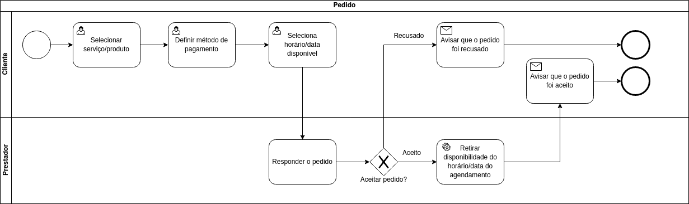
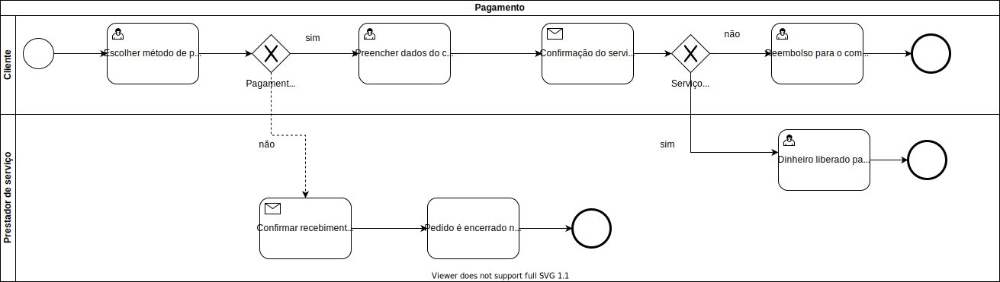
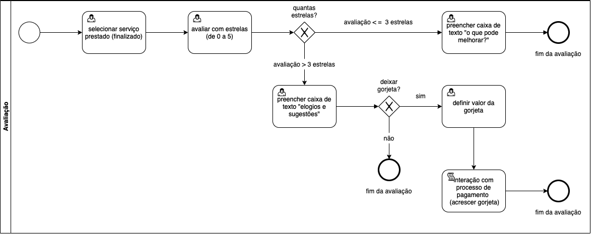
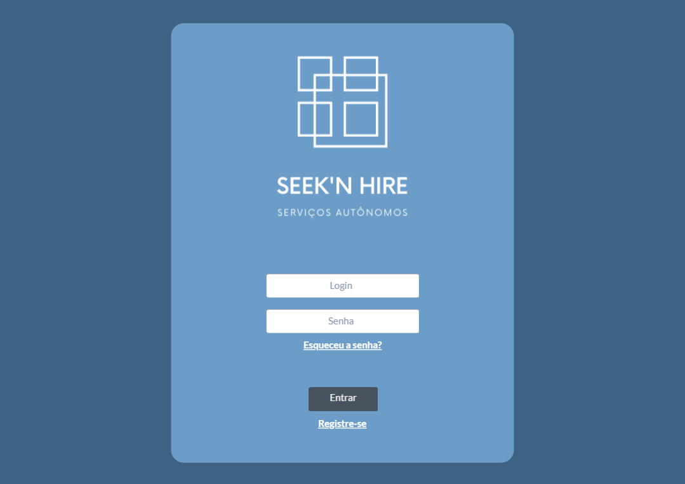
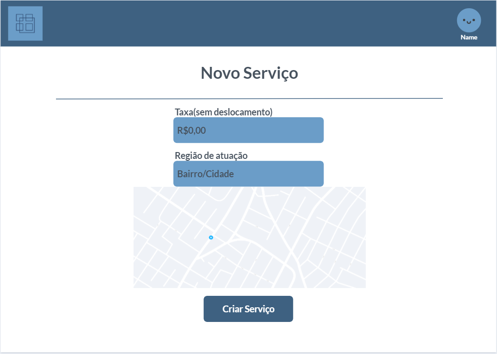

# Seek N' Hire

**Andre Cota Guimarães, 1202002@sga.pucminas.br**

**Anna Laura Reis Dornelas, annalaura.rdg@gmail.com**

**Frederico Martins Rodrigues, fredmrodrigues@outlook.com**

**Renan Cleyson Fagundes Pereira, rcfpereira@sga.pucminas.br**

**Vinicius Levi Viana de Oliveira, vinicius.levi@sga.pucminas.br**

---

_Curso de Engenharia de Software, Unidade Praça da Liberdade_

_Instituto de Informática e Ciências Exatas – Pontifícia Universidade Católica de Minas Gerais (PUC MINAS), Belo Horizonte – MG – Brasil_

---

_**Resumo**. Escrever aqui o resumo. O resumo deve contextualizar rapidamente o trabalho, descrever seu objetivo e, ao final,
mostrar algum resultado relevante do trabalho (até 10 linhas)._

---

## 1. Introdução

    1.1 Contextualização

A prestação de serviços de maneira autônoma aumentou com o passar dos anos. De acordo com o IBGE, em 2019, mais de 24 milhões de pessoas trabalhavam por conta propria, o que possibilitou uma redução na taxa de desemprego do país.

Considerando a pandemia da COVID-19, pode-se dizer que a taxa de trabalhadores autônomos tende a aumentar, assim como tende a aumentar o uso do meio digital, no qual pode ser utilizado como um novo meio para conectar o prestador ao empregador.

Assim, a necessidade de integrar o meio digital com a prestação de serviços se torna cada vez mais necessaria para se atingir um cenário melhor.

    1.2 Problema

Com a tendência da taxa de desemprego do país aumentar, a informalidade tende a ser a saída para várias pessoas. Dessa forma, redes sociais estão se tornando cada vez mais comuns para a divulgação de prestações de serviços, mas essas plataformas são limitadas por conta da função do aplicativo nunca ser a prestação de serviço.

Nesse sentido, as pessoas apresentam mais dificuldade em começar a prestar algum serviço, assim como pessoas a procura desses serviços apresentam dificuldade em encontra-los. Além disso, é necessario confiança entre contratante e prestador para o pagamento do serviço, o que pode dificultar ainda mais que ocorra a prestação.

Outro problema enfrentado por prestadores é a necessidade de organizar a sua agenda de serviços, o que pode lhe tomar tempo e, em caso de engano, o cliente e prestador sairiam penalizados.

Portanto, o prestador apresenta diversos problemas relacionado ao processo de atendimento, divulgação e pagamento de serviços, assim como clientes apresentam problemas em encontrar prestadores. Assim, os meios utilizados atualmente se mostram obsoletos para solucionar os problemas que prestadores de serviço e seus clientes podem ter.

    1.3 Objetivo geral

O objetivo com nosso trabalho é facilitar a busca por serviços no geral, tanto para os que procuram fornecer quanto aos que necessitam do serviço.

        1.3.1 Objetivos específicos

Oferecer um sistema que gerencie conexões entre pessoas prestadores ou que desejam contratar serviços, baseando-se na região em que elas se encontram. 
A aplicação fornecerá tambem um ranqueamento que informará ao usuário se a pessoa em contato presta um bom serviço ou se é um bom contratante.
Terá um calendário com as possibilidades de agendamento pelo próprio sistema.   

    1.4 Justificativas

Estamos com o intúito de desenvolver o projeto, pois apartir de perguntas levantadas em nosso questionário, boa parte das pessoas que precisam contratar algum
serviço específico tem somente como principais fontes: redes sociais, buscadores(como Goole, Bing etc) e indicações de conhecidos.
Ao desenvolver o projeto facilitaremos que as pessoas achem quem está a procura, possibilitando até mesmo achar serviços com uma maior qualidade e menor preço.

## 2. Participantes do processo

Foi feita uma análise através de um questionário virtual (disponível no link https://pt.surveymonkey.com/r/TI-Seekn-Hire) que definiu os seguintes perfis de usuário:
•    Pessoas interessadas em contratar um serviço informal de maneira objetiva, tendo como prioridade a segurança, agilidade e qualidade do serviço;
•    Pessoas interessadas em oferecer um ou mais serviços informais com o intuito de atingir uma quantidade abrangente de potenciais clientes.

Os perfis foram traçados em diferentes faixas etárias, ambos os sexos (masculino e feminino) e com objetivos específicos, filtrados e analisados pelo questionário.

Para respondentes que utilizaram o questionário se baseando em usuários que necessitam contratar algum serviço, destacam-se as respostas pela forma mais usual de busca por serviços, relatividade das avaliações pela qualidade de prestação dos serviços e a segurança para se efetuar o pagamento pelos serviços prestados.
A busca por serviços é geralmente realizada através de indicações de familiares e amigos. A busca no Google foi a modalidade que ocupou o segundo lugar no ranking, seguida por busca em empresas especializadas e grupos de redes sociais, respectivamente.
De forma unânime, os respondentes consideram que um profissional bem-avalidado/indicado é relevante para a decisão de contratação.
Em relação à segurança para efetuar o pagamento, a maioria dos respondentes considera mais seguro que o pagamento seja realizado após o serviço ser concluído.

Em relação aos respondentes que utilizaram o questionário se baseando em usuários que necessitam oferecer algum serviço, destacam-se as respostas pelas modalidades de serviços a serem oferecidas, a modalidade de divulgação dos serviços e a segurança para se receber por algum serviço prestado.
Os serviços em destaque oferecidos com base nas respostas são:
•    Serviços de babá e formatação de computadores, representando 28,5% das respostas;
•    Aulas particulares;
•    Serviços de cuidador(a) de animais;
•    Serviços médicos.
O meio mais comum de divulgação de serviços é através das redes sociais, seguido por divulgação direta em grupos de amigos/familiares e distribuição de panfletos, respectivamente. 16% dos respondentes não fazem divulgação dos serviços que prestam.
Em relação à segurança para se receber por algum serviço prestado, a maioria dos respondentes considera receber após o serviço ser finalizado, justificando passar mais credibilidade para quem contrata o serviço.

Também com base no questionário, foi identificado o perfil de Stakeholders que oferecem serviços de viagens particulares.

# 3. Modelagem do processo de negócio

## 3.1. Análise da situação atual
Atualmente temos pessoas que necessitam de serviços diversos, para que elas procurem este serviço é necessário procurar indicação de outras pessoas ou em redes sociais, como Facebook ou Whatsapp. O problema disso é que são métodos que não facilitam a divulgação ou a contratação do serviço, podem não ser seguros e não são eficientes. Nosso sistema é um lugar onde uma pessoa que presta serviço vai deixar seu serviço online e o solicitante poderá solicitar esse serviço. A segurança do usuário virá em primeiro lugar, a avaliação do prestador do serviço e do solicitante serão necessárias para esse controle, também é possível agendar a solicitação, fazendo com que o usuário tenha a certeza de que o horário que ele deseja será cumprido e o prestador poderá fazer os serviços de acordo com sua agenda.

## 3.2. Descrição Geral da proposta

Segundo o Instituto Brasileiro de Geografia e Estatística (IBGE), em 2019 o desemprego atingiu cerca de 11,9% da população brasileira, em 2020 essa situação piorou, com o desemprego chegando a 13,5% da população, isso equivale a 13,4 milhões de pessoas. Com isso, percebe-se que existe a necessidade de oportunidade de melhorar a renda. De acordo com a necessidade identificada, a proposta principal da equipe é permitir pessoas que ofereçam variados serviços se disponibilizem à realização de atividades em uma única plataforma, além disso, têm-se a proposta de permitir pessoas que necessitem dos serviços busquem-os nessa mesma plataforma.

## 3.3. Processos

### 3.3.1 Processo 1 – Processo de cadastramento de usuário

### 3.3.2 Processo 2 – Processo de cadastramento de serviço de usuário

### 3.3.3 Processo 3 - Processo de pedido

### 3.3.4 Processo 4 – Processo de pagamento 

### 3.3.5 Processo 5 - Processo de avaliação

## 4. Projeto da Solução

### 4.1. Detalhamento das atividades

Descrever aqui cada uma das propriedades das atividades de cada um dos processos. Devem estar relacionadas com o modelo de processo apresentado anteriormente.

#### Processo 1 – Cadastramento de Usuário

**Formulário**

| **Campo** | **Tipo** | **Restrições** | **Valor default** |
| --- | --- | --- | --- |
| Nome Completo | Caixa de texto | Ao menos duas palavras | - |
| Data de Nascimento | Data | Mínimo 18 anos | - |
| CEP | Caixa de texto | Números | - |
| CPF | Caixa de Texto | Formato de CPF | - |
| Login | Caixa de Texto | Formato de e-mail | - |
| Senha | Caixa de Texto | mínimo de 8 caracteres | - |

#### Processo 2 – Cadastramento de Serviço de Usuário

**Serviço prestado**

| **Campo** | **Tipo** | **Restrições** | **Valor default** |
| --- | --- | --- | --- |
| Selecionar serviço | Seleção única | Obrigatório | - |
|    |    |     |

**Área de atuação**
| **Campo** | **Tipo** | **Restrições** | **Valor default** |
| --- | --- | --- | --- |
|  Selecionar área de atuação  |  Caixa de texto  |   -  |  -  |
|    |    |     |

**Taxa de serviço**
| **Campo** | **Tipo** | **Restrições** | **Valor default** |
| --- | --- | --- | --- |
|  Definir taxa  |  Número  |   -  |  -  |
|    |    |     |

**Horário de atuação**
| **Campo** | **Tipo** | **Restrições** | **Valor default** |
| --- | --- | --- | --- |
|  Horário  |  Data(HH:MM) |  Obrigatório |  -  |
|  Dia  |  Data(DD/MM/AA) |  Obrigatório |  -  |
|    |    |     |

**Forma de pagamento**
| **Campo** | **Tipo** | **Restrições** | **Valor default** |
| --- | --- | --- | --- |
|  Selecionar forma de pagamento  |  Múltipla escolha  |  Mínimo uma forma de pagamento  |  -  |
|    |    |     |

#### Processo 3 – Processo de Pedido

**Selecionar Pedido**

| **Campo** | **Tipo** | **Restrições** | **Valor default** |
| --- | --- | --- | --- |
| Pequisar serviço | Texto | Obrigatorio | - |
|  Selecionar serviço  |  Escolha única | Obrigatorio | - |

**Selecionar forma de pagamento**

| **Campo** | **Tipo** | **Restrições** | **Valor default** |
| --- | --- | --- | --- |
| Selecionar forma de pagamento | Escolha única | Obrigatorio | - |

**Selecionar horário/data disponivel**

| **Campo** | **Tipo** | **Restrições** | **Valor default** |
| --- | --- | --- | --- |
| horário | Data(HH:MM) | Deve ser em um horário disponivel para o prestador | Horario atual |
| Dia | Data(DD/MM/AA) | Deve ser em um dia disponivel para o prestador | Data atual |

**Responder pedido**

| **Campo** | **Tipo** | **Restrições** | **Valor default** |
| --- | --- | --- | --- |
| Aceitar | Botão | - | - |
| Recusar | Botão | - | - |

#### Processo 4 – Processo de Pagamento

**Selecionar Pagamento**

| **Campo** | **Tipo** | **Restrições** | **Valor default** |
| --- | --- | --- | --- |
| Selecionar método de pagamento | Seleção única | Campo obrigatório| - |
| Dados do cartão | Numerico | Deve ter 16 caracteres e ser valido | - |
| Validade do cartão | Data | Deve ser uma data passada que a de agora | - |
| Nome impresso no cartão | Texto | Deve estar em maisculas | - |
| CVV | Númerico | Deve ter 3 números | - |

**Reembolso para o Comprador**
| **Campo** | **Tipo** | **Restrições** | **Valor default** |
| --- | --- | --- | --- |
| Recebeu serviço | Boolean | - | Sim |
| Código do banco | Númerico | - | - |
| Agência | Númerico | Deve conter 5 dígitos | - |
| Conta | Númerico | Deve conter 11 digitos e o número verificador | - |
| Nome completo | Texto | - | - |
| CPF | Número | Deve conter 11 digitos | 000.000.000-00 |

**Dinheiro liberado para o fornecedor do serviço**
| **Campo** | **Tipo** | **Restrições** | **Valor default** |
| --- | --- | --- | --- |
| Recebeu serviço | Boolean | - | Sim |
| Código do banco | Númerico | - | - |
| Agência | Númerico | Deve conter 5 dígitos | - |
| Conta | Númerico | Deve conter 11 digitos e o número verificador | - |
| Nome completo | Texto | - | - |
| CPF | Número | Deve conter 11 digitos | 000.000.000-00 |

#### Processo 5 – Processo de Avaliação

| **Campo** | **Tipo** | **Restrições** | **Valor default** |
| --- | --- | --- | --- |
| Avaliação | Numérico | - | - |
| Caixa de texto "O que pode melhorar?" | Texto | Avaliação de rate igual ou menor que 3 estrelas; máximo 999 caracteres | - |
| Caixa de texto "Elogios e sugestões" | Texto | Avaliação de rate maior que 3 estrelas; máximo 999 caracteres | - |
| Deixar gorjeta? | Botão | Sim; não | - |
| Valor da gorjeta | Números | Não aceita caracteres não numéricos | 02,00 |

### 4.2. Tecnologias

As tecnológias utilizadas pelo grupo nesse projeto serão Javascript para comunicação entre front e o banco de dados, o MySQL para configuração no banco e o HTML5 e CSS3 para estruturação da página. Como framework nós usaremos o bootstrap. A IDEE utilizada foi o Vscode, para fazer os wireframes utilizamos o Marvel App e para organização de sprint e documentação utilizamos o Github.

#### 4.2.1. Wireframes

##### 4.2.1.1 Login

##### 4.2.1.2 Registro de Usuario

##### 4.2.1.3 Página inicial

##### 4.2.1.3.1 Página inicial pt2

##### 4.2.1.4 Cadastro de serviço (página 01)

##### 4.2.1.4.1 Cadastro de serviço (página 02)

## 5. Modelagem de dados

## 6. Indicadores de desempenho

| **Indicador** | **Objetivos** | **Descrição** | **Cálculo** | **Fonte dados** | **Perspectiva** |
| --- | --- | --- | --- | --- | --- |
| Quantidades de acessos | Verificar com qual frequência as pessoas buscam serviços | Analizar semanalmente quantas vezes uma mesma pessoa acessa a plataforma |  | Pagina principal | --- |
| Qualidade de serviços | Mostrar para os clientes os serviços com maiores qualidades | Por meio de voltos de 1 à 5 verificar quem teve a maior quantidade de votos | nota atual+montante/quantos votos | Ranking interno | Indicador de qualidade |
| Sucesso de vendas | Avaliar quantos serviços não foram completados | Verifica o porque do atendimento não ter sido completado | serviços cancelados*100/servicos totais | Descrição do cancelamento | Aprendizado e Crescimento |
| Indicador de produtividade | Quantos serviços são fechados por hora | Mede qtd de requisições atendidas por dia | | Tabela solicitações | Processos internos |
| Indicador de Ticket Medio | Verifica quais os valores de tickets sao mais buscados | Mede quais preços dos serviços mais solicitados |  | Tabela Pedidos |  |

## 7.Sistema desenvolvido

Tentamos deixar o sistema mais simples possível, para que o usuário não tenha dificuldade em utilizar e nem precise ficar mudando muitas telas para navegar. Com isso produzimos, além das telas de cadastro de usuario, login e cadastro de serviço, uma tela inicial intuitiva, tela para solitar um serviço, pagamento e envio de nota ao prestador de serviço.  

## 8. Avaliação

O software é sim viável por se tratar de um portal em que os serviços em si são realizados pelos proprios usuarios e o sistema atua somente como o intermediador entre eles, fazendo com que a troca de informação e serviços ocorra de uma maneira mais prática e segura para ambos os lados, porém não atendeu nossas expectatívas uma vez que não concluímos todos os objetivos propostos para o projeto.

## 9. Conclusão

O trabalho nos deu uma boa ideia de como é trabalhar como uma "Fábrica de Software", indo desde um simples ideia, passando pelo aprimoramento dela até chegar ao ponto de colocarmos a mão na massa e produzir de fato do zero um sistema com banco de dados próprio. Foi um ótima experiência já que com ela aprendemos que o entrosamento com o grupo faz total diferença no resultado final do projeto e que o desfalque também tras um grande peso. Infelizmente não conseguimos colocar o sistema funcionando 100% como gostariamos, precisando remover processos que seriam importantes já que aprender a mexer com sistemas e tecnologias novas foi um parte complicada.
Cada integrante teve um papel importante que contribuiu para todo o grupo:
André Cota: Organização de tarefas
Anna Laura: Front End
Frederico Martins: Separar ideias
Renan Cleyson: BD
Vinicius Levi: Back End
# APÊNDICES

**Colocar link:**

Código: https://github.com/ICEI-PUC-Minas-PPLES-TI/plf-es-2021-1-ti2-0940100-seek-n-hire/tree/master/codigo

Artefatos: https://github.com/ICEI-PUC-Minas-PPLES-TI/plf-es-2021-1-ti2-0940100-seek-n-hire/tree/master/artefatos

Apresentação final: https://github.com/ICEI-PUC-Minas-PPLES-TI/plf-es-2021-1-ti2-0940100-seek-n-hire/blob/master/documentacao/Apresentação%20Final.pptx

Vídeo de apresentação: https://github.com/ICEI-PUC-Minas-PPLES-TI/plf-es-2021-1-ti2-0940100-seek-n-hire/blob/master/documentacao/Video_Apresentacao.mkv

